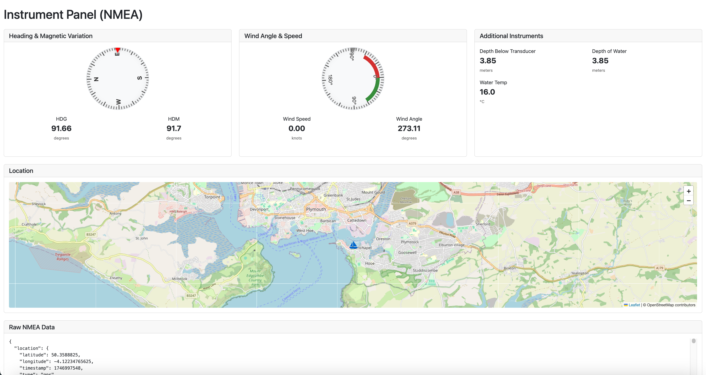

# Notecard NMEA Instrument Panel

This is a simple web page that displays the data collected by an ESP32 listening to SignalK NMEA messages over UDP. These are then gathered and sent via a Notecard to Notehub. The data is then routed to a server where it is displayed in a dashboard.

## Features

- Compass
- Wind Speed and Angle
- Water Speed and Heading
- Depth Below Transducer
- Depth of Water
- Depth below keel
- Mean Temperature of Water

## Installation

1. Clone the repository
2. Install the dependencies
3. Run the server
